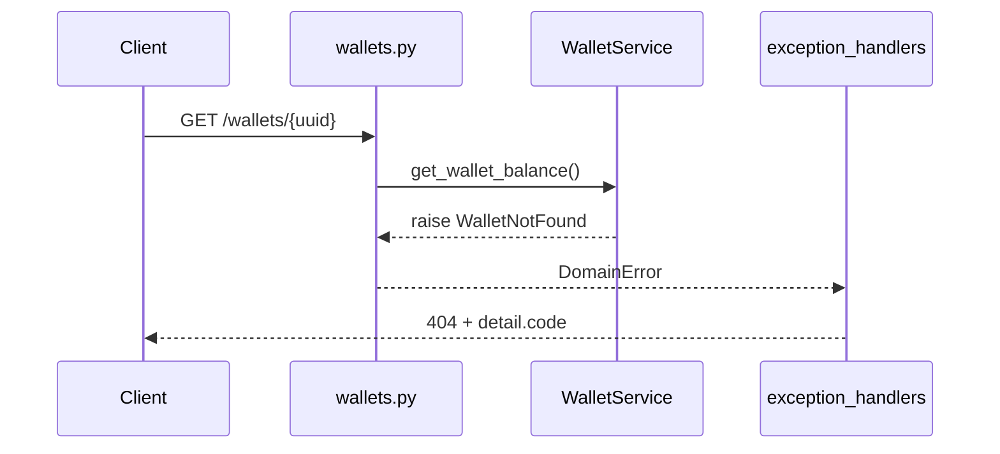
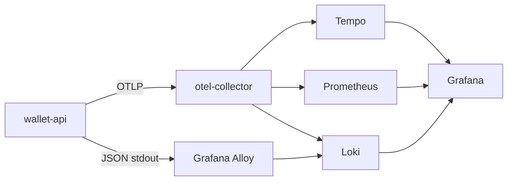

# Wallet API

REST API для работы с балансом кошельков пользователей.

## Запуск (Docker)

Скопируйте переменные окружения:

```bash
cp .env.example .env
```

Поднять приложение и PostgreSQL:

```bash
docker compose up --build
```

- Swagger API: http://localhost:8000/docs

При старте контейнера `app` автоматически: `alembic upgrade head` → seed → uvicorn.

Сгенерировать файл миграции:

```bash
docker compose run --rm --entrypoint sh app -c "alembic revision --autogenerate -m 'описание_изменений'"
```

Применить миграции к БД:

```bash
docker compose run --rm --entrypoint sh app -c "alembic upgrade head"
```

Остановка:

```bash
docker compose down
```

Сброс данных БД:

```bash
docker compose down -v
```

## API

| Метод | Путь | Описание |
|-------|------|----------|
| GET | `/api/v1/wallets/{wallet_uuid}` | Текущий баланс |
| POST | `/api/v1/wallets/{wallet_uuid}/operation` | DEPOSIT / WITHDRAW |

Пример тела операции:

```json
{
  "operation_type": "DEPOSIT",
  "amount": 1000
}
```

## Seed (тестовые кошельки)

| UUID | Баланс |
|------|--------|
| `11111111-1111-1111-1111-111111111111` | 1000.00 |
| `22222222-2222-2222-2222-222222222222` | 500.00 |

Повторный seed вручную:

```bash
docker compose run --rm --entrypoint sh app -c "python -m scripts.seed"
```

## Тесты

```bash
docker compose run --rm --entrypoint sh app -c "alembic upgrade head && pytest -q"
```
**ОСТОРОЖНО! Выполнение команды очистит таблицы wallets, operations в БД.**

Покрытие: health, GET/POST wallets, 404/400/422, конкурентный withdraw.

## Архитектура: доменные ошибки

Сервисы выбрасывают доменные исключения (`WalletNotFound`, `InsufficientFunds`). HTTP-коды и JSON задаёт слой API.



## Слои проекта

| Слой | Путь | Назначение |
|------|------|------------|
| Domain | `app/domain/` | enum, исключения (без FastAPI/SQLAlchemy) |
| DB | `app/db/base.py` | `Base` для ORM |
| Models | `app/models/` | таблицы SQLAlchemy |
| Schemas | `app/schemas/` | Pydantic DTO для API |
| Repositories | `app/repositories/` | запросы к БД (SQLAlchemy) |
| Services | `app/services/` | бизнес-операции, оркестрация |
| API | `app/api/` | HTTP, exception handlers |

`OperationType` определён в `app/domain/enums.py` и используется в ORM и Pydantic-схемах.

## Репозитории (фаза 3)

SQL вынесен в `WalletRepository` и `OperationRepository`. Сервисы не строят `select`/`update` — только вызывают репозитории и кидают доменные исключения.

```text
API → Service → Repository → ORM / PostgreSQL
```

## Зависимости

Единый источник правды: **`pyproject.toml`** + зафиксированные версии в **`uv.lock`**.

Локально:

```bash
uv sync --group dev
uv run alembic upgrade head
uv run pytest -q
uv run ruff check .
```

Обновить lock после смены зависимостей:

```bash
uv lock
```

Docker собирает окружение через `uv sync --frozen --group dev`.

## Observability (OpenTelemetry, фазы 1–6)

Опциональный prod-like стек в отдельных контейнерах:

```bash
docker compose -f compose.yaml -f compose.observability.yaml up --build
```

| URL | Сервис |
|-----|--------|
| http://localhost:8000/docs | Wallet API |
| http://localhost:3000 | Grafana (admin / admin) |
| http://localhost:9090 | Prometheus |

**Tempo** — хранилище трейсов (waterfall запроса: HTTP → service → SQL).  
**Grafana Alloy** — агент: собирает JSON-логи из stdout контейнеров → Loki.

Приложение шлёт **OTLP** только в **OTel Collector** (`4317`). Collector маршрутизирует в Tempo / Prometheus / Loki.

Подробнее и контракт для нескольких сервисов: [docs/observability.md](docs/observability.md).



## Линтер (PEP8) — Ruff

Конфиг Ruff — в **`pyproject.toml`**, секция `[tool.ruff]`.

Проверка стиля в Docker:

```bash
docker compose run --rm --entrypoint sh app -c "ruff check . && ruff format --check ."
```

`ruff format .` — автоформатирование; `ruff format --check .` — только проверка без изменений файлов.

## Решения по домену

- Кошельки создаются скриптом seed. По несуществующему UUID → `404`.
- Суммы — `Decimal` / `NUMERIC` в БД.
- Невалидное тело запроса → `422`. Недостаточно средств при `WITHDRAW` → `400`.
- Ошибки API: `{"code": "...", "message": "..."}`.

## Конкурентность: почему race condition решена

При параллельных списаниях с одного кошелька баланс не уходит в минус: используется атомарный `UPDATE` в PostgreSQL (`WHERE balance >= amount` для WITHDRAW) и одна транзакция на операцию (обновление баланса + запись в `operations`).

Реализация: `app/services/operation_service.py`.

Проверка: `tests/test_concurrency.py` — 10 параллельных WITHDRAW по 200 при балансе 1000.
